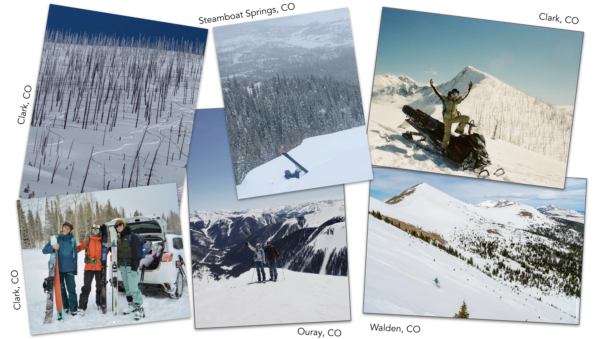

*UCSB MEDS* - *EDS 222 - Stats for Environmental Data Science*

# A Look At Elevated Risk Factors for Avalanche Accidents in Colorado: Uncovering the Role of Season and Elevation for Avalanche Risk in R

     

**Author:** Nicole Pepper




This repo houses a [Quarto markdown document](https://github.com/nicolelpepper/co-avalanche-accidents/blob/main/co-avalanche-accidents.qmd) of a blog post that explores my analysis of avalanche accident risk factors in Colorado. This study uses data from [Colorado Avalanche Information Center(CAIC)](https://avalanche.state.co.us/), which is an organization that provides avalanche education, research, and daily forecasting for the public. They have a robust avalanche reporting and forecasting system. I'm an avid snowboarder and like to go into the backcountry using touring gear or by snowmobiling. I use CAIC as a tool to help mitigate risk in avalanche terrain. Knowing that elevation plays an important role in how CAIC designates and communicates avalanche risk, I designed my research question around how elevation and season impact the risk of an avalanche accident.

**Link to Quarto File on GitHub**: https://github.com/nicolelpepper/co-avalanche-accidents/blob/main/co-avalanche-accidents.qmd
### Repo Structure:

```
co-avalanche-accidents
│   README.md
│   qmd/Rmd/Proj files
|   .gitignore
│
└───data
│      │   avalanche_accidents.csv
│
└───images
```
### References:

- Colorado Avalanche Information Center (CAIC), CAIC Accident Data 2023 (https://avalanche.state.co.us/accidents/statistics-and-reporting) *Access date: 12/01/24*
- United States Geologic Survey (USGS), The National Map - Elevation Point Query Service.(https://apps.nationalmap.gov/epqs/) Accessed using [`Elevator`](https://cran.r-project.org/web/packages/elevatr/index.html) package in R. *Access date: 12/01/24*

### Acknowledgments:
This assignment was created for UCSB MEDS, EDS 223 - Statistics for Environmental Data Science. Thank you to our professor Max Czapanskiy and teaching assistant Leo Feitosa for their wisdom and support throughout the class.
